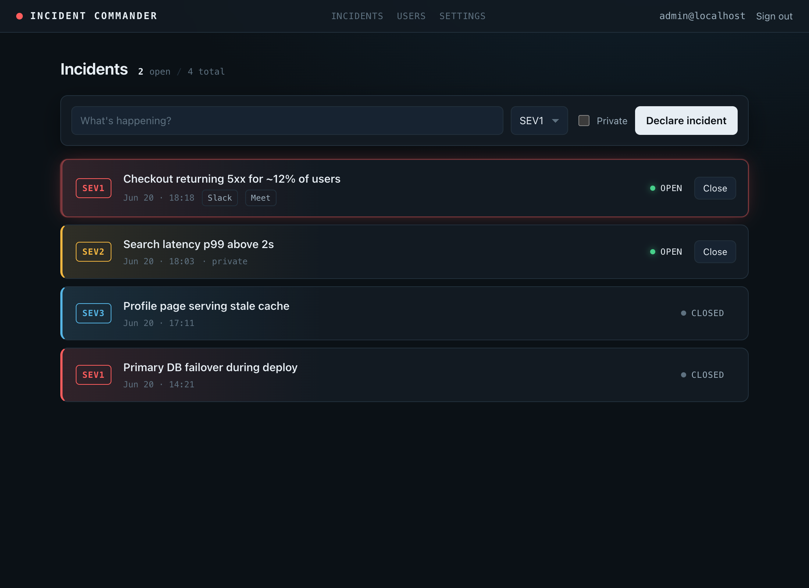

# Incident Commander

Open-source, self-hosted incident management. Declare an incident with one click and — once
configured — it opens a Slack channel and a Google Meet, keeps a history of everything, and
gives you a calm place to run the response. Built to be run by your own team, on your own
infrastructure.

[](https://github.com/giammbo/incident-commander/actions/workflows/ci.yml)
[](LICENSE)
[](pyproject.toml)

> **Status — core complete; Slack, Google, and SMTP integrations shipped.** Run it today: local
> auth + RBAC, the full incident lifecycle, configurable severities, a services catalogue, and the
> optional Slack / Google Meet / Google SSO / SMTP-invite integrations are all in place.



## Features

- **Self-hosted, one command up** — FastAPI + HTMX served from a single container, Postgres, via Docker Compose.
- **Local accounts** — email + password (argon2). On first start a protected `admin` account is created and its generated password is printed to the logs (Grafana-style); you're forced to change it on first login.
- **Group-based RBAC** — three roles (Admin, Incident Commander, Read-only); a user's effective role is the highest across their groups.
- **User & group management** — an admin UI to invite users (by email when SMTP is set, or with a generated temporary password), organize groups, and assign roles.
- **Incident lifecycle** — declare an incident (title, severity, public/private, affected services), add a **Markdown description**, browse the history, open a detail view, **edit** it (title/description/severity/services), and close it.
- **Configurable severities** — define your own severity levels (e.g. `P1–P4` or `SEV1–SEV5`) with labels, **colours**, and order, managed in Settings. Colour is the dashboard's organizing signal.
- **Services catalogue with dependencies** — register the services/applications you operate, declare a dependency graph between them, and link incidents to the affected services (with their dependencies shown for blast-radius context).
- **Slack** *(optional)* — connect workspaces via OAuth; declaring an incident auto-opens a channel, posts an opened/updated/closing message, and stamps the topic.
- **Google** *(optional)* — "Sign in with Google" SSO (domain-restricted, with a local break-glass) and an auto-created Google Meet bridge per incident.
- **Encrypted settings** — all integration credentials/tokens are stored encrypted at rest (Fernet); secrets are never rendered in the UI or written to logs.
- **A UI built for the job** — a dark "war room" where colour means severity, so the eye goes straight to what's on fire. Markdown descriptions are rendered safely (sanitized).

All integrations are **optional and partial-failure-safe**: an incident is always created as a record, and a Slack channel or Meet is only added when you select a connection — a failing integration is surfaced on the incident, never a 500.

## Quick start (Docker Compose)

Requires Docker.

```bash
git clone https://github.com/giammbo/incident-commander.git
cd incident-commander
cp .env.example .env
```

Generate the two required secrets and put them in `.env`:

```bash
# SESSION_SECRET
python -c "import secrets; print(secrets.token_urlsafe(48))"
# FERNET_KEYS
python -c "from cryptography.fernet import Fernet; print(Fernet.generate_key().decode())"
```

Then bring it up:

```bash
docker compose up --build
```

Open <http://localhost:8000>. The **bootstrap admin password is printed once in the app logs**
on first start — log in as `IC_ADMIN_EMAIL` (default `admin@localhost`) and change it immediately.

```bash
docker compose logs app | grep "Generated password"
```

## Configuration

Bootstrap secrets live in the environment (`.env`). Everything else — Slack/Google/SMTP
credentials, **severity levels**, and the **services catalogue** — is configured at runtime from
the admin **Settings** page (secrets stored encrypted in the database).

| Variable | Purpose | Required | Default |
|---|---|---|---|
| `DATABASE_URL` | Postgres connection (`postgresql+psycopg://…`) | yes | built from `POSTGRES_*` in Compose |
| `SESSION_SECRET` | Signs the session cookie | yes | — (generate it) |
| `FERNET_KEYS` | Comma-separated Fernet keys for encrypting secrets at rest (first encrypts; the rest enable rotation) | yes | — (generate it) |
| `BASE_URL` | Public base URL (used for OAuth redirects later) | yes | `http://localhost:8000` |
| `IC_ADMIN_EMAIL` | Email of the bootstrap admin | no | `admin@localhost` |
| `SESSION_HTTPS_ONLY` | Mark the session cookie `Secure` — **set `true` in production behind HTTPS** | no | `true` (Compose ships `false` for localhost) |
| `POSTGRES_USER` / `POSTGRES_PASSWORD` / `POSTGRES_DB` | Compose Postgres credentials | no | `ic` / `ic` / `incident_commander` |

> `FERNET_KEY` (singular) is accepted as a convenience alias for a single `FERNET_KEYS` value.

## Development

```bash
uv sync                 # install deps (Python 3.12)
cp .env.example .env     # fill SESSION_SECRET and FERNET_KEYS
uv run pytest            # run the test suite — Docker required (testcontainers spins up Postgres)
uv run ruff check .      # lint
uv run ruff format .     # format
```

See [CONTRIBUTING.md](CONTRIBUTING.md) for the full contributor guide.

## Architecture

A single server-rendered FastAPI service: Jinja2 templates with HTMX (no JavaScript build step),
sync SQLAlchemy 2.0 + psycopg3 against Postgres, Alembic migrations applied on startup. Secrets
are encrypted at rest with Fernet; bootstrap secrets come from the environment. Slack and Google
are **optional** integrations — an incident is always created as a record, and a channel or Meet is
only added when a connection is selected. Markdown descriptions are rendered with `markdown` and
sanitized with `nh3`.

## Roadmap

- **Phase 1 — Core platform & auth** ✅
- **Phase 2 — SMTP & email invites** ✅
- **Phase 3 — Slack integration** (auto-create the incident channel) ✅
- **Phase 4 — Google** (SSO login + auto-created Google Meet) ✅
- **Enrichment** — configurable severities, services + dependency graph, Markdown descriptions, incident editing ✅

## Security

Integration credentials and tokens are encrypted at rest (Fernet), passwords are hashed with
argon2, and sessions use a signed cookie. Please report vulnerabilities privately — see
[SECURITY.md](SECURITY.md). Run behind HTTPS with `SESSION_HTTPS_ONLY=true` in production.

## Contributing

Contributions are welcome — see [CONTRIBUTING.md](CONTRIBUTING.md) and our
[Code of Conduct](CODE_OF_CONDUCT.md).

## License

Apache License 2.0 — see [LICENSE](LICENSE) and [NOTICE](NOTICE).

Dependencies are permissively licensed (MIT / BSD / Apache-2.0), with one exception: the Postgres
driver [`psycopg`](https://www.psycopg.org/) is LGPL-3.0. It is used as an unmodified, separately
installed library, which is compatible with shipping this project under Apache-2.0; its LGPL notice
is retained.
